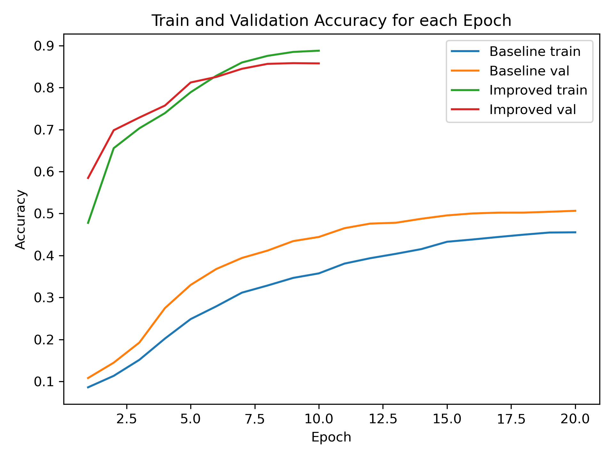

# Video Gesture Recognition: 2D vs 3D CNN

Classifying hand-gesture videos from the [Jester dataset](https://www.qualcomm.com/developer/software/jester-dataset/downloads) (27 classes) with two models:

- **Baseline:** 2D ResNet-18 trained from scratch on a **single frame** per video.
- **Improved:** Kinetics-pretrained 3D ResNet-18 (`r3d_18`) on a **16-frame clip**, so it can see motion.

Both are trained on a 20% subset of the training data (limited hardware) and evaluated on the full validation set.

## Results

| Model | Input | Validation accuracy |
|---|---|---|
| Baseline 2D | 1 frame | **50.7%** |
| Improved 3D | 16 frames | **85.8%** |

<p>  </p>

The single-frame model struggles with gestures that look alike but move differently (e.g. swiping left vs right). The 3D model mostly fixes this; its remaining errors are mainly opposite-direction pairs such as turning clockwise vs counterclockwise. See `confusion_matrix_baseline.png` and `confusion_matrix_improved.png`.

## Contents

| File | Purpose |
|---|---|
| `baseline.py`, `improved.py` | Train each model |
| `confusion_matrix_*.py` | Confusion matrix + list of misclassified videos |
| `plot_stats.py` | Accuracy/loss plots |
| `jester-v1-*.csv` | Labels and train/validation splits |
| `results\` | Saved results |

## Usage

```bash
pip install torch torchvision pillow tqdm numpy matplotlib scikit-learn
```

Put the Jester frame folders (one folder per video ID) in `small-20bn-jester-v1/`, then run:

```bash
python baseline.py          # saves jester_baseline_model.ckpt
python improved.py          # saves jester_improved_model.ckpt
python confusion_matrix_baseline.py
python confusion_matrix_improved.py
python plot_stats.py
```

Set `use_small_train = False` in the training scripts to use the full training set.

## Authors

Kacper Nizielski and Emmanouil Zagoritis. Computer Vision course, Leiden University (2025).
